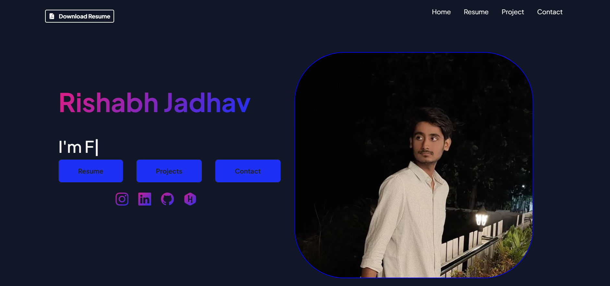
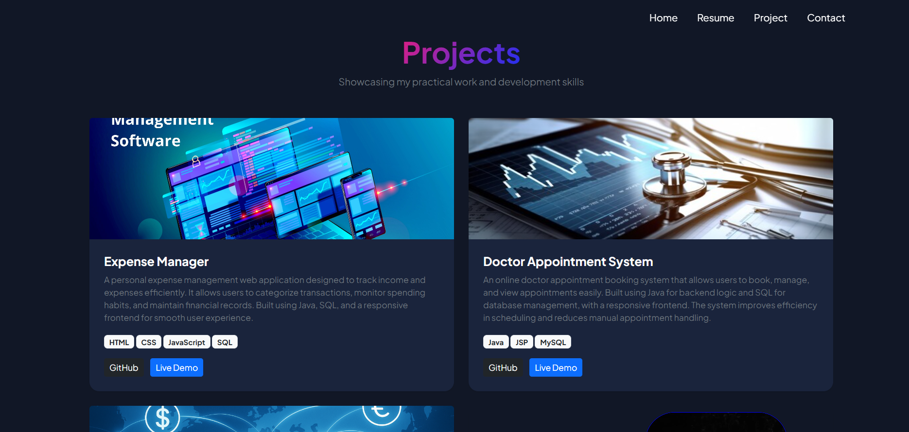
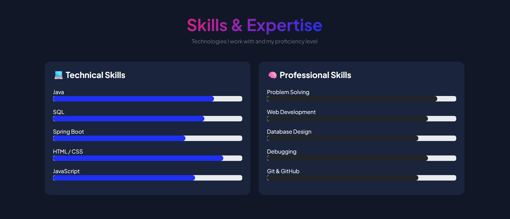
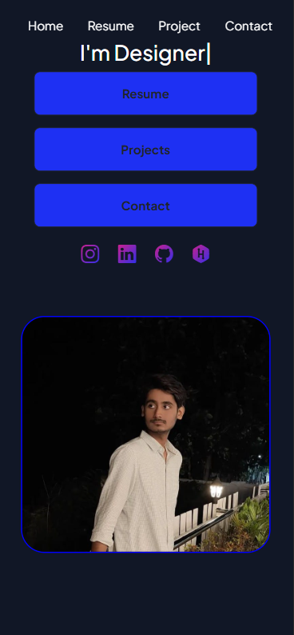

# 🌐 Rishabh Jadhav - Portfolio Website

## 📌 About the Project

This is my personal portfolio website built to showcase my skills, projects, and experience as a developer. It represents my work, learning journey, and technical abilities in web development.

---

## 🚀 Features

* 💼 Professional portfolio design
* 📱 Fully responsive (works on mobile, tablet, desktop)
* 🧑‍💻 Projects section with GitHub links
* 📄 About Me section
* 📬 Contact form integration (Formspree)
* 🌐 Live deployed website

---

## 🛠️ Tech Stack

* HTML5
* CSS3
* Bootstrap
* JavaScript

---

## 📂 Sections Included

* Home
* About
* Skills
* Projects
* Contact

---

## 🔗 Live Demo

👉 https://rishabhjadhav-portfolio.netlify.app/

---

## 📸 Screenshots

### 🏠 Home Page


### 👨‍💻 Projects Section


### 🛠️ Skills Section


### 📱 Mobile View


### 

---

## ⚙️ How to Run Locally

1. Clone the repository

```bash
git clone https://github.com/your-username/your-repo-name.git
```

2. Open the folder
3. Run `index.html` in your browser

---


## 👨‍💻 Author

**Rishabh Jadhav**

* GitHub: https://github.com/Rishabh-Jadhav
* LinkedIn: https://www.linkedin.com/in/rishabh-jadhav-55b550372/

---

## 📬 Contact

Feel free to connect with me for opportunities, collaboration, or queries.


⭐ If you like this project, don't forget to star the repository!
